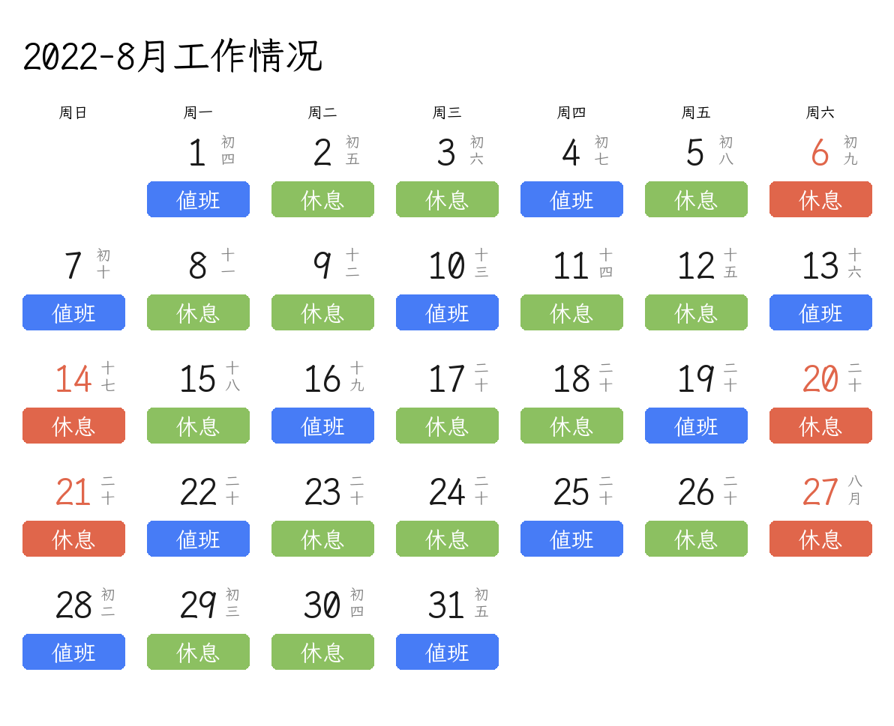

# pillowExample_2

通过Pillow模块和Python3自动生成每周值班表的小栗子。具体的说明请参考[如何DIY一个每月工作日历图生成器](https://0w0.in/2022/07/rhdygmygzrltscq/)

值得注意的是，本程序 *不* 包含开发所需的字体文件，请自行下载并放到相同目录即可执行。

字体文件为*[霞鹜文楷](https://github.com/lxgw/LxgwWenKai/)*，前往其 release 下载并解压出其中的 LXGWWenKaiMonoTC-Regular.ttf 字体。放到 makeTest.py 同目录下即可。

## 食用方法

- 本地运行

前往 release 页面下载文件，解压后执行：`python3 main.py` ,然后程序就会在当前目录生成一张 `2022-08.png`。

该程序也可以生成别的日期图片，请参考前文所述文章内容进行修改后执行即可。

感谢*[Avimitin](https://github.com/Avimitin)*提供的这个README文件模板，感谢字体提供*[霞鹜文楷](https://github.com/lxgw/LxgwWenKai/)*,感谢*[ZhDate](https://github.com/CutePandaSh/zhdate)*中国农历日期处理对象.

如有错误或不恰当的地方，欢迎您到上述文章评论指正，或给我发送私信。
